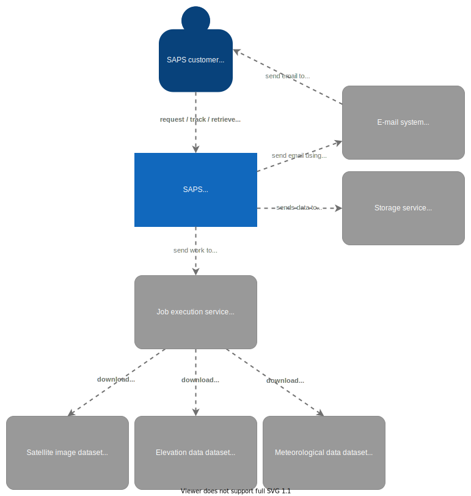
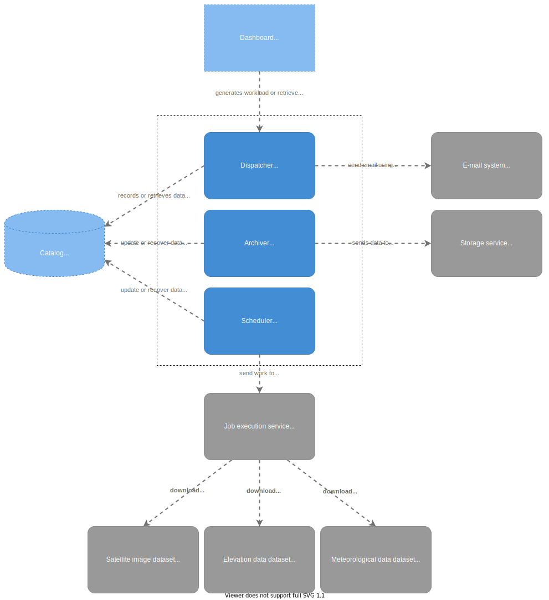
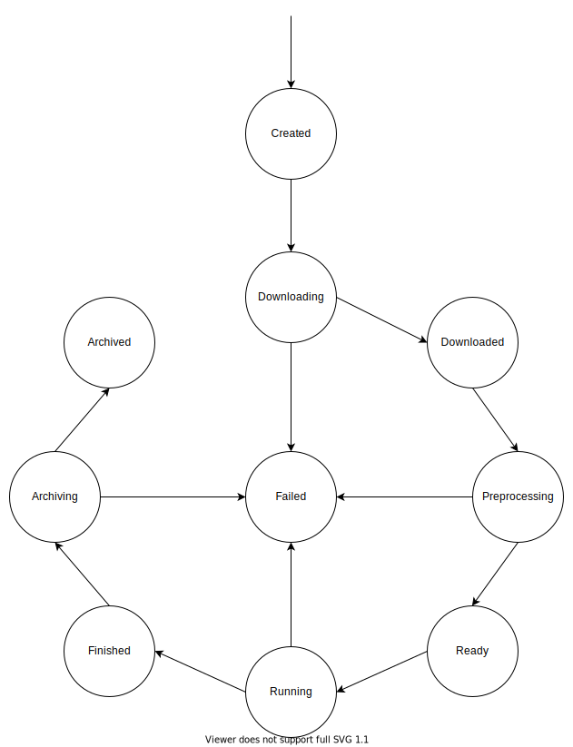

# SAPS

SAPS project for the construction of an automated platform that performs the calculation of the SEBAL method using satellite images.

## Architectural Description

That document was based mainly on the [C4 model](https://c4model.com/).

## Overview

SAPS is a project that aims to process satellite images using the [SEBAL method](https://en.wikipedia.org/wiki/SEBAL) in order to facilitate the user (usually a researcher) who wants to perform analyzes on the results obtained by its automatic processing. More details about the project can be seen at [this link](https://www.sciencedirect.com/science/article/pii/S0098300419302961)

### Satellite image

Satellite image is an image file ([TIFF](https://en.wikipedia.org/wiki/TIFF)) obtained by remote sensing from an artificial satellite. There are different image collection satellites, the best known of which are QuickBird, Ikonos, Landsat and Spot.

In the context of SAPS, the only supported satellite family is [Landsat](https://en.wikipedia.org/wiki/Landsat_program).

### SEBAL Method

SEBAL (Surface Energy Balance Algorithm for Land) is an algorithm that uses the surface energy balance to estimate aspects of the hydrological cycle, then mapping information such as evapotranspiration, biomass growth, water deficit and soil moisture.

This quantification of the energy balance is calculated using satellite data that originate characteristics of the Earth's surface, such as surface albedo, leaf area index, vegetation index and surface temperature. In addition to satellite images, the SEBAL model requires meteorological data, such as wind speed, humidity, solar radiation and air temperature for the analysis region.

### Scripts

SAPS is composed of 3 major parts to perform its processing (whose template is described [here](https://github.com/ufcg-lsd/saps-scripts-template)), they are:
- [inputdownloading](https://github.com/ufcg-lsd/saps-scripts-inputdownload): responsible for acquiring the data to be used, such as elevation, weather data or even the satellite images themselves.
- [preprocessing](https://github.com/ufcg-lsd/saps-scripts-preprocessing): responsible for preparing the data obtained, for example, extracting pixels from clouds / cloud shadows, [reprojection of images](https://docs.qgis.org/2.14/en/docs/user_manual/working_with_projections/working_with_projections.html), among others.
- [processing](https://github.com/ufcg-lsd/saps-scripts-processing): responsible for the application of the final algorithm (for example, SEBAL) in the preprocessed data to generate new useful data for the user in order to perform analysis and information extraction.

These phases are selected by the user forming a processing pipeline, each of these phases is implemented and executed using Docker containers configured and prepared for the execution of the step requiring only the input data.

## Main objective

Implement a platform where users can request/track/retrieve satellite image processing in a given time and location, which will be performed automatically.

## Specific objectives

Have a comprehensive platform that can process images from different types of satellite families (LANDSAT, ...) and compute different image processing methods, in addition to SEBAL.

## Context

In the context diagram it is presented as if the interaction of the other elements with the SAPS platform occurs. Firstly we have customers, who request satellite image processing (in a time and place interval), then they access to monitor the execution of their processing and finally after they finish, retrieve the data calculated by SAPS from the images provided at the entrance.

We also have the e-mail service that is used by SAPS to send messages to the user, mainly about the final data of a processing. In addition to datasets (satellite images, elevation data and meteorological data) which are very useful for obtaining information for processing. The storage service serves to store final or partial data from the processing performed by SAPS, this is intended for an external service that has good technology that deals better with security and data persistence issues.

Finally, the job execution service that is responsible for receiving a workload and executing it, and then sending information about the execution. For example, selecting a VM with 2GB ram and 4 CPUs, lifting an X docker container (in the case of SAPS it will be the algorithms of the inputdownloading, preprocessing or processing steps) and executing the Y and Z commands with the arguments A and B. For Finally, the service will monitor the execution and collect the exitcodes for each command and conclude whether the job was successful or failed. What is important in this service is to know the final state of execution and to keep the results in an accessible and safe place.

There is a complicated thing associated between the datasets and the job execution service that will be covered in the component view.

## Containers

In the container diagram, the SAPS system is expanded into three new blocks:
- [Dashboard](https://github.com/ufcg-lsd/saps-dashboard): Responsible for interacting with the user in an easy way and generating workload
- Application API: Responsible for interacting with workload or information retrieval GUI requests and processing them
- [Catalog](https://github.com/ufcg-lsd/saps-catalog): Responsible for recording information about processing and users

### Dashboard

The Dashboard has an interface with some simple operations like:
- **Submit new processing request** generating SAPS application workload
- **Track processing** by checking the processing states making the SAPS application generate a listing of the information for the user
- **Get results** by generating SAPS application workload for organizing the resulting data and making it available via email

### Application API

The API has some simple operations like:
- Add new processing request
- Add new user
- Retrieve processing information
- Submit processing results

### Catalog

The database is responsible for maintaining user data and processing.

## Components

The component diagram shows three main components pertaining to the application:
- [Dispatcher](https://github.com/ufcg-lsd/saps-dispatcher): Responsible for registering new processes or users, and obtaining them, in addition to sending an email to the user to obtain the results of the processing
- [Archiver](https://github.com/ufcg-lsd/saps-archiver): Responsible for obtaining finished and ready processes for archiving the resulting / partial data in the storage service
- [Scheduler](https://github.com/ufcg-lsd/saps-scheduler): Responsible for scheduling the execution of the processing steps with the job execution service

### Why is there an extra layer between the datasets and the job execution service?

As stated in the section on the context model, the job execution service performs a workload sent by SAPS (Scheduler) that will be processed in an environment. This environment in turn will run the algorithms of the inputdownloading, preprocessing and processing steps that are in Dockers containers.

In the execution of these algorithms (mainly of inputdownloding phase), the data present in the satellite image, elevation and weather data datasets will be obtained, in this case, there is still a small layer of the SAPS being executed represented by the algorithms run in the job execution service to communicate with these datasets.

It is important to note that this section is useful to fill the introduction seen in the overview with the SAPS platform in questions of how the data is obtained, not being done by any of the components, but by an algorithm that is executed within the job execution service. .

## Information flow

The information flow diagram describes the states that the processing can reach, starting in the **created** state and ending (if successful) in **archived**. There are some points of failure in the states of downloading, preprocessing, running and archiving, which are originated by:
- downloading: the files related to the processing were not found in the datasets of satellite images, weather or elevation data, or are corroborated. It can also happen due to an unexpected situation that occurred at this stage.
- preprocessing/running: the downloaded files are not as expected, or are missing, or some unexpected situation
- archiving: the files to be stored have problems sending to the storage service, or some unexpected problem