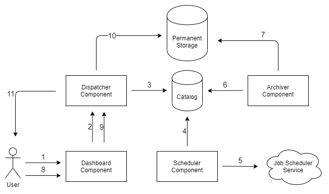
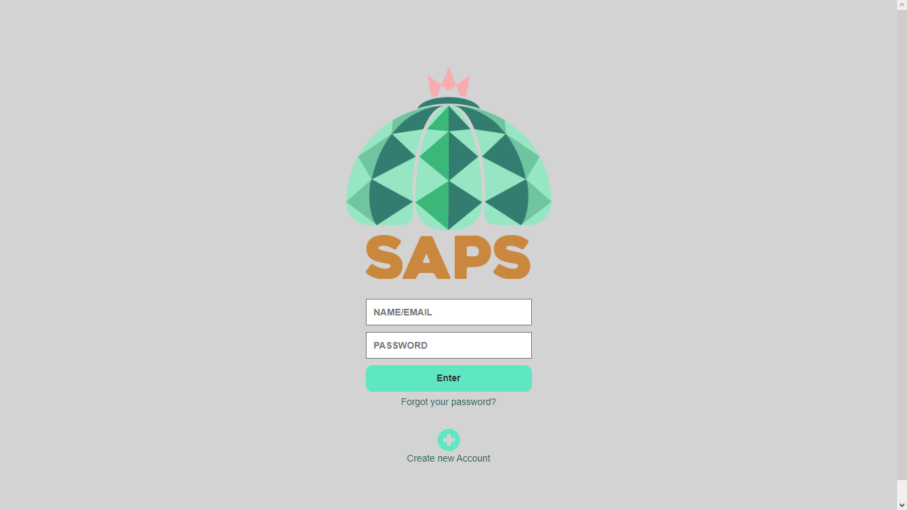
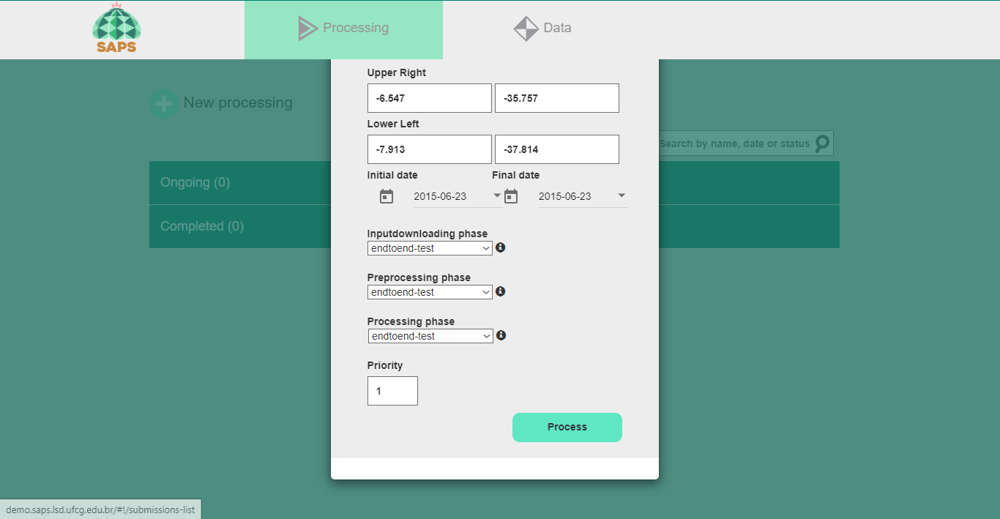
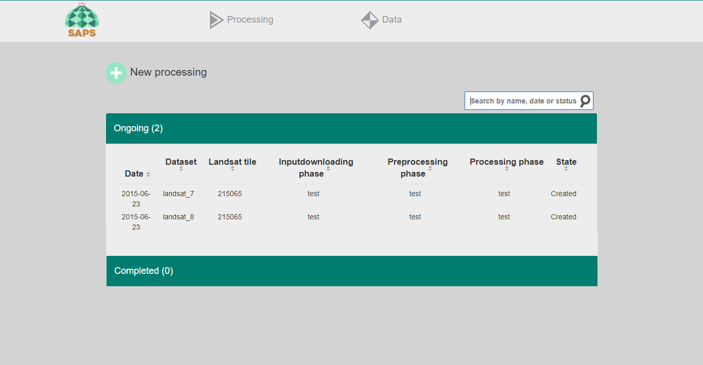
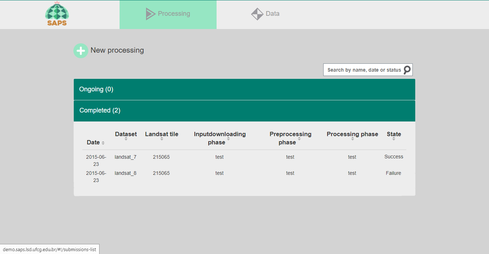
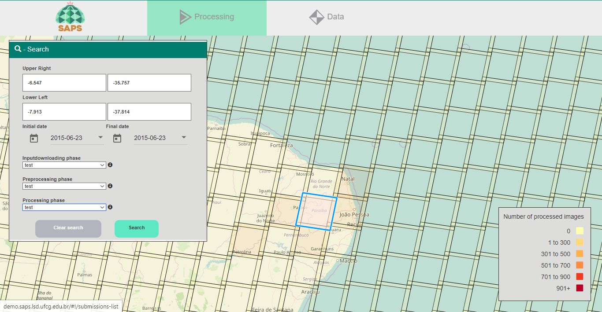
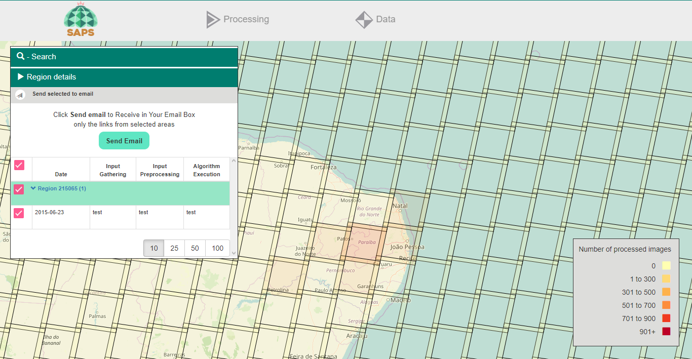

# Overview

Here an overview of the test will be described ...

# Test flow



Here an description of the test flow steps ...

# Configure

It is necessary to configure the scripts that will be used by the SAPS pipeline to be able to produce the same result expected by the test, for that, we must configure three components to recognize these test scripts.

**Note: After the changes, it is necessary to restart the components**

### Configuring Dashboard

In the [SAPS script file](/public/dashboardApp.js) replace the value of the variable `scriptsTags` by:

```javascript
let scriptsTags = 
{
"inputdownloading":[
    {
      "name": "test",
      "docker_tag": "test",
      "docker_repository": "fogbow/inputdownloading"
    }
  ],
  "preprocessing":[
    {
      "name": "test",
      "docker_tag": "test",
      "docker_repository": "fogbow/preprocessor"
    }
  ],
  "processing":[
    {
      "name": "test",
      "docker_tag": "test",
      "docker_repository": "fogbow/worker"
    }
  ]
}
```

### Configuring Dispatcher and Scheduler

In the [SAPS script file](/resources/execution_scripts_tags.json) replace it with the following json:

```json
{
"inputdownloading":[
    {
      "name": "test",
      "docker_tag": "test",
      "docker_repository": "fogbow/inputdownloading"
    }
  ],
  "preprocessing":[
    {
      "name": "test",
      "docker_tag": "test",
      "docker_repository": "fogbow/preprocessor"
    }
  ],
  "processing":[
    {
      "name": "test",
      "docker_tag": "test",
      "docker_repository": "fogbow/worker"
    }
  ]
}
```

# Run

### 1. Login to the Dashboard



Access the GUI through the url ```$dashboard_access_ip:$dashboard_access_port``` and connect using valid credentials.

### 2. Create new processing



When connecting successfully, click on `New Processing`, fill in the fields as in the image above and click on `Process`

### 3. New processing created



After a few seconds, it will be possible to observe the image above, that is, two new processes have been created and are in the initial state (`Created`), wait for at least half an hour until they are completed.

### 4. Processing completed



After the two processes are completed, the GUI will be similar to the image above, one with LANDSAT 8 with a successful end state (`Success`) and the other with LANDSAT 7 with a failed end state (`Failure`).

# Check results

### 1. Data tab



In the data tab, fill in the fields as shown in the image above and click on `Search`.

### 2. Send email



After completing the search, the result shown in the image above will be displayed, check the option with the information of the processing done and click on `Send email`.

### 3. Download datas

Here it will be described how the body of the email will arrive and how to download the data of the selected processing.

### 4. Comparing results

Here is a table with the expected checksum for each file and how to calculate the checksum for each file for comparison.

